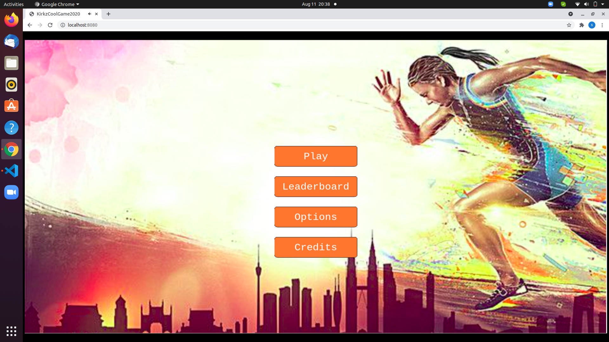

# Phaser_Game

Its a coin collecting game, where runner runs on varied platforms to collect coins and avoid bomb for survival in project.

## Using This Project

1. Make a directory somewhere in your file system where you want to keep your project.
1. `cd` into that directory from the command line.
1. Clone this project with `git clone https://github.com/snowbillr/phaser3-webpack-es6-dev-starter.git`.

## Installing Dependencies

1. From the cloned project's directory, run `npm run install`.

## Running The Project

Once you've installed the project's dependencies, you can run the project using `npm run start`.

1. Open up your browser to `http://localhost:8080`.

1. Builds code bundle with production settings `npm run build`.

